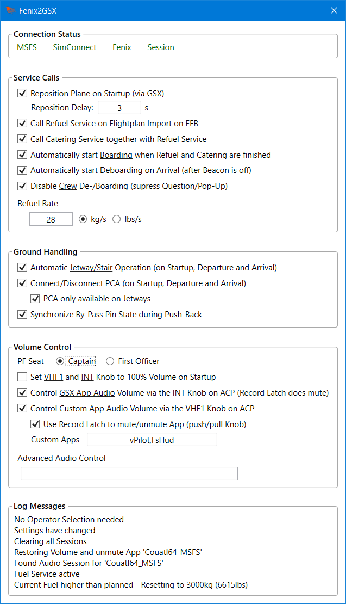

# Fenix2GSX
<br/>
Full and proper GSX Integration and Automation for the Fenix A320! <br/>

- The Refuel Service fill's the Tanks as planned (or more correctly GSX and Fenix are "synched")
- Calling Boarding load's Passengers and Cargo, as does Deboarding for unloading (or more correctly GSX and Fenix are "synched")
- Ground Equipment (GPU, Chocks, PCA) is automatically set or removed
- All Service Calls except Push-Back, De-Ice and Gate-Selection can be automated
- GSX Audio can be controlled via the INT-Knob from the Cockpit
- ATC Volume can be controlled via the VHF1-Knob from the Cockpit (or any other App you wish)
- The other Audio-Channels on the ACP can also be used to control the Volume of even more Apps

<br/><br/>

## Requirements
- Windows 10/11
- [.NET 7](https://dotnet.microsoft.com/en-us/download/dotnet/7.0) x64 Runtime (.NET Runtime and .NET Desktop Runtime. Do not confuse it with arm64!) installed & updated. Reboot when installing the Runtimes for the first Time.
- MobiFlight [WASM Module](https://github.com/MobiFlight/MobiFlight-WASM-Module/releases) installed in your Community Folder
- MSFS, Fenix, GSX Pro :wink:

<br/><br/>
## Installation / Update
Extract it anywhere you want, but do not use Application-Folders, User-Folders, the Windows' Program File Folders or even C:\\ <br/><br/>
Please remove the old Version completely before updating / extracting the new Version!<br/>Keep in Mind that this resets all Settings to the Defaults. (You can keep your old .config, but only as Reference - don't replace the newer with an old one)<br/><br/>
It may be blocked by Windows Security or your AV-Scanner, try if unblocking and/or setting an Exception helps.<br/><br/>
You can check if the .NET Runtimes are correctly installed by running the Command `dotnet --list-runtimes` - the Version you downloaded should show up there.<br/><br/>

If you own a registered Copy of FSUIPC, you can start it automatically through that. Add this to your FSUIPC7.ini:
```
[Programs]
RunIf1=READY,KILL,X:\PATH\YOU\USED\Fenix2GSX.exe
```
The ini-File is in the Folder where FSUIPC was installed to, remember to change the Path to the Binary. If there are multiple RunIf-Entries, make sure they are numbered uniquely and that the [Programs] Section only exists once.<br/>
When starting it manually (or by other means), either start it before MSFS or when MSFS is in the Main Menu.<br/>
When starting it by other means, please ensure the Working Directory is set correctly (to the Path where the Binary is).


<br/><br/>
## Configuration
**Fenix**:<br/>
Disable **Auto-Door** and **Auto-Jetway** Simulation in the EFB!<br/><br/>

**Fenix2GSX**:<br/>
The Configuration is done through the UI, open it by clicking on the System-Tray/Notification-Icon. The UI does not open from itself! The Settings are stored persistently in the *Fenix2GSX.dll.config* File - so set them once to your Preference and you should be fine :smiley:<br/>
All Options have ToolTips which explains them further.<br/>
You can close the Windows/UI without Problems, Fenix2GSX will continue to run. The UI is only there for Configuration, you don't need to have it open to have Fenix2GSX doing its Work.
<br/><br/>
<br/><br/>
All Settings can be changed dynamically on the Fly if needed. But do that before a Service/Feature starts or after it has ended. For example, don't disable "Automatic Jetway/Stair Operation" while the Jetway is connected. Do it before the Tool calls the Jetway or after it was disconnected by the Tool.<br/><br/>
In general, it is up to your Preference how much Automation you want. If you want to keep Control of when Services are Called and/or the Jetway is connected, you can still enjoy the (De-)Boarding and Refueling Syncronization when the Automation-Options are disabled. The only Automation which can not be disabled: The Removal of the Ground-Equipment and Jetway-Disconnection (if still connected) is always active on Depature.<br/><br/>
A Note on the Audio-Control: The Tool does not control Audio until the Plane is **powered** (=FCU is On). Be aware, that the Fenix defaults to 50% Volume on INT and VHF1 when loaded - that is why Fenix2GSX defaults to set them to 100% on Startup. You can disable that if you want.<br/>When you end your Session, Fenix2GSX will try to reset the Application-Audio to unmuted and last set Volume (before it started controlling the Volume). But that does not really work on GSX because it is resetting at the same Time. So **GSX can stay muted** when switching to another Plane (if it was muted) - keep that in Mind.<br/><br/>
The new **"Advanced Audio Control"** can be used to Control other Apps with the other Channels (VHF2, VHF3, HF1, HF2, CAB, PA) - one App, one Channel. Their knobs are not moved on Start-Up and the Record Latch always mutes/unmutes the App. But that Settings follow the configured Seat-Position and therefore which ACP is used for Audio-Control.
<br/><br/>
Options not available in the GUI - can be changed in *Fenix2GSX.dll.config* (Fenix2GSX restart needed. Don't touch any other Option):

- **logLevel**: When I request a "Verbose-Log" on Support-Requests, change the Value to "Verbose" here
- **ignoreAudioDevice**: Ignore a certain Sound Device when searching for Audio-Sessions for Volume-Control (Device Name as seen in your Windows Volume Control / Device List). Certain Sound Cards / Applications (e.g. Sonic Studio Virtual Mixer) mirror the Sound-Sessions to a virtual Device which messes up the Volume-Control Feature.
- **autoConnectDelay**: Delay in Seconds before Jetway/Stairs are called on Session Start (only there). Delay can be cancelled with the INT/RAD Switch.
- **ignorePaxSafeguard**: Boarding and Deboarding have Safeguard that ignores any Change greater 15 Passengers. Set this only to "true" if you have Problems with Boarding/Deboarding (that is, the Plane is not fully boarded or deboarded).
- **finalDelayMin**: Minimum Delay in Seconds before the Final LS is transmitted after Boarding.
- **finalDelayMax**: Maximum Delay in Seconds before the Final LS is transmitted after Boarding.

<br/><br/>

**GSX Pro**:
- Make sure you do not have a customized Aircraft Config (GSX In-Game Menu -> Customize Aircraft -> should show only "Internal GSX Database"). If you want to keep your customized Config for whatever Reason, make sure the Option **"Show MSFS Fuel and Cargo during refueling"** is disabled!
- If using any Automation Option from Fenix2GSX, make sure **"Assistance services Auto Mode"** is disabled in the GSX Settings (GSX In-Game Menu -> GSX Settings -> Simulation)
- If you have troubles with Refueling, try if disabling "Always refuel progressively" and "Detect custom aircraft system refueling" in the GSX Settings helps. (Though it should work with these Settings)
- Please ensure you have entered your **SimBrief Username** and have **Ignore Time** checked. If you still should have Issues with Boarding (e.g. only 10 Pax boarded), please disable *Estimate passengers number*
- For **Automated staircases** semi-automatic (half-checked) is recommended - but it should work with all Modes
- The De-/Boarding Speed of Passengers is dependant on the Passenger Density Setting (GSX In-Game Menu -> GSX Settings -> Timings). Higher Density => faster Boarding. *BUT*: The Setting **Extreme** is too extreme! Boarding does not work with this Setting.
- Ensure the other two Settings under Timings are on their Default (15s, 1x).

<br/><br/>

## General Service Flow / Usage
There might be Issues when used together with FS2Crew - please uncheck "Fuel Truck" in the Settings! (that is "FS2Crew: Fenix A320 Edition", the RAAS Tool is fine!)<br/>
There also Issues reported when used together with Self-Loading Cargo.

1) Create your SB Flightplan and start MSFS as you normally would. Depending on your Configuration, start the Tool before MSFS or when MSFS is in the Main Menu.
2) When your Session is loaded (Ready to Fly was pressed), wait for the Repositioning and Jetway/Stair Call to happen (if configured).
3) Import your Flightplan on the EFB (wherever you're using it from, does not need to be the EFB in the VC). Refueling and Catering will be called (if configured). *Always* import a Flightplan on the EFB, regardless of Configuration. Power up the Plane from Cold & Dark before importing the Flightplan.
4) When Refueling and Boarding are finished (whoever called it), you will receive your Final Loadsheet after 90-150s (Boarding finished = GSX reports the Service as completed). The left Forward Door will be closed when this happens (if not already closed by GSX). Also when both Services are finished and the APU is Avail and the APU Bleed is switched ON: the PCA will be removed (if configured to connect)
5) When the Parking Brake is set, External Power is disconnected (on the Overhead) and Beacon Light is On, the Tool will remove all Ground-Equipment: Jetway/Stairs (if not already removed) and GPU, PCA & Chocks (always, to be safe). Ground-Equipment is also removed when Push-Back is called - make sure you have set you're Parking Brake :wink:
6) Happy Flight!
7) When you arrive (pre-select your Gate), the Jetway/Stairs will automatically connect as soon as the Engines are Off and the Parking Brake is set (if configured).
8) When the Beacon Light is off, the other Ground-Equipment will placed: GPU, PCA (if configured) and Chocks (it may be placed earlier, I can't change the Behavior of the Fenix). If configured, Deboarding will be called. Calling Deboarding in the EFB is not required, it is best to dismiss that. Only generate a new Flightplan in SimBrief until Deboarding has actively started!
9) It works with Turn-Arounds! As soon as you (re)import a new Flightplan the Cycle starts over (after Deboarding has completely finished).

<br/>

NOTE: You can also use the **INT/RAD** Switch on the ACP to trigger some Services in certain Situations. Move the Switch to the INT Position and leave it there. When Fenix2GSX reacts to the Request it will reset the Switch Postion as Confirmation! Services triggerable:

- Request Boarding - regardless if Auto-Boarding is configured and even when Catering & Refueling are still active.
- Request Push-Back, after Refueling & Boarding are finished (regardless of who called them). Be aware that calling Push-Back also triggers the removal of Ground-Equipment. And removing the Equipment that Way does not care about the Position of the Parking-Brake, External Power or APU. So nobody holds you back sitting in a free-rolling and unpowered Plane, possibly injuring the Ground-Crew because they unplugged the Cable while being actively used 😅<br/>
Make sure to *enable the GSX Menu* again at that Point! Fenix2GSX only calls the Service, but does not answer any Push-Back related Question in the GSX Menu.
- Abort/Confirm Push-Back. While the the Push-Back is running you can abort it (that is Menu Option 1, "Stop here and complete pushback" - the correct Way of aborting the Push). When you have "Good engine start confirmation" enabled in GSX you can answer that GSX Question also with that Switch (after GSX asks you to do so).<br/>
Be aware that this only works if you have "Synchronize By-Pass Pin" enabled.
- Request Deboarding, after Parking Brake set, Engines off and Beacon off. If Automatic Jetway/Stair Operation is enabled, wait for them to be called. Works regardless if Auto-Deboarding is enabled (so you can force the Deboard Request if needed)

<br/>If you set every Option for automatic Service Calls, I'd recommend to disable the GSX Menu in the Toolbar (Icon not white). The Services are still called, but you won't see the Menu popping-up. So De-Ice and Gate-Selection are the only Situations where you need to enable the menu again. And Push-Back, if you don't use the INT/RAD Switch.<br/>
Be aware that Fenix2GSX automatically selectes the first Operator in the List if GSX asks for a Selection (Ground Handling, Catering). If you're picky about which Operator should appear, you have to disable the Automatic Jetway Operation and the Automatic Catering Call!<br/><br/>
Be cautious on the Mass and Balance Page in the EFB: Don't change the planned Numbers and don't use *"Load Aircraft"* or *"Reset All"* - they likely break the Integration. *"Resend Loadsheet"* should not hurt though if needed! (In Case the Prelim-LS wasn't send automatically by the Fenix due to EOBT or because the Plane had no Power yet).<br/><br/>
Tip for VATSIM / IVAO: Disable the automatic Jetway Operation before loading the Session in MSFS, in Case you need to move to another Gate. If the Gate is free (or you have moved to a free one) you can renable Auto-Connect and the Jetway/Stairs will still connect then (unless the Flightplan was already loaded in the EFB).<br/><br/>
