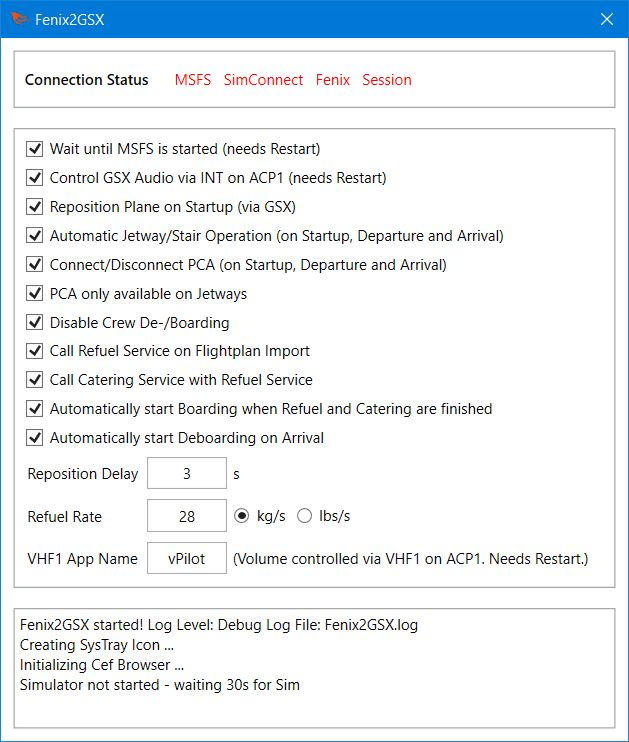

# Fenix2GSX
<br/>
Full and proper GSX Integration and Automation for the Fenix A320! <br/>

- The Refuel Service fill's the Tanks as planned (or more correctly GSX and Fenix are "synched")
- Calling Boarding load's Passengers and Cargo, as does Deboarding for unloading (or more correctly GSX and Fenix are "synched")
- Ground Equipment (GPU, Chocks, PCA) is automatically set or removed
- All Service Calls except Push-Back, De-Ice and Gate-Selection can be automated
- GSX Audio can be controlled via the INT-Knob from the Cockpit
- ATC Volume can be controlled via the VHF1-Knob from the Cockpit (ATC Application configurable)

<br/><br/>

## Requirements
- Windows 10/11
- [.NET 7](https://dotnet.microsoft.com/en-us/download/dotnet/7.0) x64 Runtime (.NET Runtime and .NET Desktop Runtime) installed & updated
- MobiFlight [WASM Module](https://github.com/MobiFlight/MobiFlight-WASM-Module/releases) installed in your Community Folder
- MSFS, Fenix, GSX Pro :wink:

<br/><br/>
## Installation
Extract it anywhere you want, but do not use Application-Folders, User-Folders or even C:\\ <br/>
Please remove the old Version completely befor updating.<br/>
It may be blocked by Windows Security or your AV-Scanner, try if unblocking and/or setting an Exception helps.<br/><br/>

If you own a registered Copy of FSUIPC, you can start it automatically through that. Add this to your FSUIPC7.ini:
```
[Programs]
RunIf1=READY,KILL,X:\PATH\YOU\USED\Fenix2GSX.exe
```
The ini-File is in the Folder where FSUIPC was installed to, remember to change the Path to the Binary. If there are multiple RunIf-Entries, make sure they are numbered uniquely and that the [Programs] Section only exists once.<br/>
When starting it manually (or by other means), either start it before MSFS or when MSFS is in the Main Menu.

<br/><br/>
## Configuration
**Fenix**:<br/>
Disable **Auto-Door** and **Auto-Jetway** Simulation in the EFB!<br/><br/>

**Fenix2GSX**:<br/>
The Configuration is done through the UI, open it by clicking on the System-Tray/Notification-Icon. They are stored persistently in the *Fenix2GSX.dll.config* File - so set them once to your Preference and you should be fine :)<br/>
<br/>
All Settings except the ones noted with "Needs Restart" can be changed dynamically on the Fly (if needed). But do that before a Service/Feature starts or after it has ended. For example, don't disable autoConnect while the Jetway is connected. Do it before the Tool calls the Jetway or after it was disconnected by the Tool.
<br/><br/>

* **waitForConnect**		- The Binary will wait until MSFS is started and SimConnect is available. Default *"true"*
* **gsxVolumeControl**			- The GSX Volume is controlled via the INT-Knob on ACP1. Default *"true"*
* **repositionPlane**			- The Plane will be repositioned via GSX when you start your Session (unless starting with Engines running). Default *"true"*
* **autoConnect**		- Automatically connect Jetway/Stairs on Startup and on Arrival. Operator Selection is done automatically if needed. Default *"true"*
* **connectPCA** 		-  The Preconditioned Air will be connected on Startup and on Arrival (and disconnected on Depature). Default *"true"*
* **pcaOnlyJetway** 		-  The Preconditioned Air will only be connected when a Jetway is available. Default *"true"*
* **disableCrew**		- Disable Crew boarding and deboarding and therefore supress the Pop-Up/Question. Default *"true"*
* **autoRefuel**		- Call Refueling automatically as soon as a Flightplan was imported in the EFB. Default *"true"*
* **callCatering**	- Catering will be called when Refueling is automatically called. Default *"true"*
* **autoBoarding** 		-  Automatically start Boarding when Refueling and Catering (if configured) are finished. Default *"true"*
* **autoDeboarding** 			-  Automatically start Deboarding on Arrival when the Beacon-Light is switched off (and Engines stopped). Default *"true"*
* **repositionDelay**			-  The Delay in Seconds, before the Plane will be repositioned (to give the Sim/GSX time to load). Default *"3"*
* **refuelRate** 			-  The Speed at which the Tanks are filled, defaults to 28 kg per Second (~62 lbs / s).
* **refuelUnit** 			-  The Unit of refuelRate - either KGS or LBS.
* **vhf1VolumeApp** 			- The Name of the Application's Binary (without .exe Extension) which will be controlled through the VHF1-Knob on ACP1. The App must be already running when Fenix2GSX starts. Defaults *"vPilot"*

<br/><br/>

**GSX Pro**:
- Make sure you do not have a customized Aircraft Config (GSX In-Game Menu -> Customize Aircraft -> should show only "Internal GSX Database"). If you want to keep your customized Config for whatever Reason, make sure the Option "Show MSFS Fuel and Cargo during refueling" is disabled!
- If using any Automation Option from Fenix2GSX, make sure "Assistance services Auto Mode" is disabled in the GSX Settings (GSX In-Game Menu -> GSX Settings -> Simulation)
- If you have troubles with Refueling, try if disabling "Always refuel progressively" and "Detect custom aircraft system refueling" in the GSX Settings helps.
- The De-/Boarding Speed of Passengers is dependant on the Passenger Density Setting (GSX In-Game Menu -> GSX Settings -> Timings). Higher Density => faster Boarding.

<br/><br/>
## General Usage
1) Create your SB Flightplan and start MSFS as you normally would. Depending on your Configuration, start the Tool before MSFS or when MSFS is in the Main Menu.
2) When your Session is loaded (Ready to Fly was pressed), wait for the Repositioning and Jetway/Stair Call to happen (if configured).
3) Import your Flightplan on the EFB (wherever you're using it from, does not need to be the EFB in the VC). Refueling and Catering will be called (if configured). Always import a Flightplan on the EFB, regardless of Configuration.
4) When Refueling and Boarding are finished (whoever called it), you will receive your Final Loadsheet after 90-150s. The left Forward Door will be closed when this happens (if not already closed by GSX). Also when both Services are finished and the APU is Avail and the APU Bleed is switched ON: the PCA will be removed (if configured to connect)
5) When the Parking Brake is set, External Power is disconnected (on the Overhead) and Beacon Light is On, the Tool will remove all Ground-Equipment: Jetway/Stairs (if not already removed) and GPU, PCA & Chocks (always, to be safe).
6) Happy Flight!
7) When you arrive (pre-select your Gate), the Jetway/Stairs will automatically connect as soon as the Engines are Off and the Parking Brake is set (if configured).
8) When the Beacon Light is off, the other Ground-Equipment will placed: GPU, PCA (if configured) and Chocks. If configured, Deboarding will be called. Calling Deboarding in the EFB is not required, you can dismiss it if you want. *DO NOT* generate a new Flightplan in SimBrief until Deboarding has finished!
9) It works with Turn-Arounds! As soon as you (re)import a new Flightplan the Cycle starts over.
<br/>
If you set every Option for automatic Service Calls, I'd recommend to disable the GSX Menu in the Toolbar (Icon not white). The Services are still called, but you won't see the Menu popping-up. So Push-Back, De-Ice and Gate-Selection are the only Situations where you need to open it.
