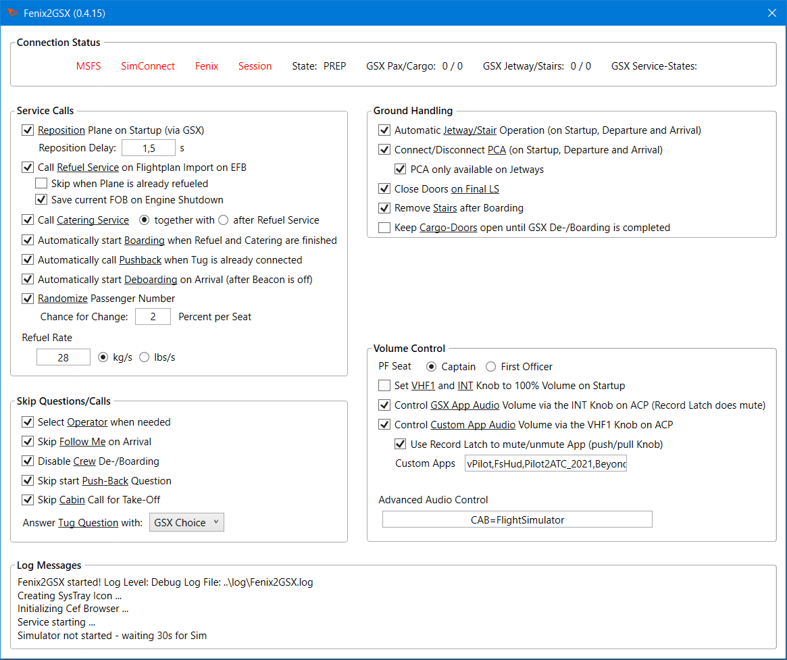

# Fenix2GSX
 
Full and proper GSX Integration and Automation for the Fenix A320!  

- The **Refuel Service is filling the Tanks** as planned (or more correctly GSX and Fenix are "synched")
- Calling **Boarding load's Passengers and Cargo**, as does Deboarding for unloading (or more correctly GSX and Fenix are "synched")
- **Ground Equipment** (GPU, Chocks, PCA) is automatically set or removed
- All **Service Calls** except Pushback, De-Ice and Gate-Selection **can be automated**
- **GSX Audio** can be controlled via the **INT-Knob** from the ACP in the Cockpit
- **ATC Volume** can be controlled via the **VHF1-Knob** from the ACP in Cockpit (or any other App you wish)
- The other Audio-Channels on the ACP can also be used to control the Volume of even more Apps

  

## Requirements
- Windows 10/11, MSFS, Fenix :wink:
- A properly working GSX Installation
- Capability to actually read the Readme up until and beyond this Point :stuck_out_tongue_winking_eye:
- The Installer will install the following Software:
  - .NET 7 Desktop Runtime (x64)
  - MobiFlight Event/WASM Module

 

[Download here](https://github.com/Fragtality/Fenix2GSX/releases/latest)

(Under Assests, the Fenix2GSX-Installer-vXYZ.exe File)

  
## Installation / Update
Basically: Just run the Installer - it will extract it for you to a fixed Location and will also install/update the neccessary Software to your PC/Sim. It even setups Auto-Start and creates a Link on the Desktop, if you want.  

Some Notes:
- Fenix2GSX has to be stopped before installing.
- If the MobiFlight Module is not installed or outdated, MSFS also has to be stopped.
- If you upgrade from Version 0.3.6 or below, delete your old Installation manually (it is no longer needed).
- From Version 0.4.0 onwards, your Configuration is *not* be resetted after Updating
- The Installation-Location is fixed to %appdata%\Fenix2GSX (your Users AppData\Roaming Folder) and can not be changed.
- For Auto-Start either your FSUIPC7.ini or EXE.xml (MSFS) is modified. The Installer does not create a Backup (not deemed neccessary), so if you want a Backup, do so yourself.
- **Do not** run as Admin!
- It may be blocked by **Windows Security** or your **AV-Scanner**, try if *unblocking* and/or *setting an Exception* helps (for the whole Fenix2GSX Folder)

  

The Program will display a **little Exclamation Mark** on the SysTray/Notification Area Icon and in the GUI to inform on a **new Version**. There is no Pop-Up and there will never be.  
.   

## Auto-Start
When starting it manually, please do so either **before MSFS** or when MSFS is in the **Main Menu**. 
To automatically start it with **FSUIPC or MSFS**, select the respective Option in the **Installer**. 

### Addon Linker
If you use Addon Linker to start your Addons/Tools, you can also add it there: 
**Program to launch** C:\Users\YOURUSERNAME\AppData\Roaming\Fenix2GSX\bin\Fenix2GSX.exe 
**Wait for simconnect** checked 
The Rest can be left at Default. 

  

## Configuration

### Fenix

Disable **Auto-Door** and **Auto-Jetway** Simulation in the EFB! 
Disable **ALL GSX** Options in the EFB! Fenix2GSX currently only works as "standalone" Solution, so it is either Fenix native or Fenix2GSX, not both. 
Make sure your **Default State** is set to either Cold & Dark or Turn-Around with GPU or APU. GSX won't provide any Services when the Engines are running.

 

### GSX Pro

- Make sure you do not have a customized Aircraft Config (GSX In-Game Menu -> Customize Aircraft -> should show only "Internal GSX Database"). If you want to keep your customized Config for whatever Reason, make sure the Option **"Show MSFS Fuel and Cargo during refueling"** is disabled!
- Fenix2GSX relies on GSX to open and close the Doors.
- If using any Automation Option from Fenix2GSX, make sure **"Assistance services Auto Mode"** is disabled in the GSX Settings (GSX In-Game Menu -> GSX Settings -> Simulation)
- If you have troubles with Refueling, try if disabling "Always refuel progressively" and "Detect custom aircraft system refueling" in the GSX Settings helps. (Though it should work with these Settings)
- Please ensure you have entered your **SimBrief Username** and have **Ignore Time** checked. Some Users have reported they also need to disable *Estimate passengers number*.
- For **Automated staircases** semi-automatic (half-checked) is recommended - but it should work with all Modes
- It is **not recommended** to use the **Always ask for pushback** Option
- The De-/Boarding Speed of Passengers is dependant on the Passenger Density Setting (GSX In-Game Menu -> GSX Settings -> Timings). Higher Density => faster Boarding.
- Ensure the other two Settings under Timings are on their Default (15s, 1x).
- As with GSX itself, Fenix2GSX runs best when you have a proper Airport Profile installed!
- Up to everyone's *Preference*, but disabling the **Aural Cues** (GSX In-Game Menu -> GSX Settings -> Audio) and setting **Message verbosity** to "*only Important*" (GSX In-Game Menu -> GSX Settings -> Simulation) can improve Immersion! 😉

 

### Fenix2GSX

The Configuration is done through the **GUI**, open it by **clicking on the System-Tray/Notification-Icon**. The UI does not open from itself! The Settings are stored persistently in the *%appdata\Fenix2GSX\Fenix2GSX.config* File - so set them once to your Preference and you should be fine :smiley:  
All Options have **ToolTips** which explains them further. When changing/adding something in the **Text-Boxes**: please either hit *Enter* or click in another Text-Box (so the one you changed loses the Input-Focus).  
You can close the Windows/UI without Problems, Fenix2GSX will continue to run. The UI is only there for Configuration, you don't need to have it open to have Fenix2GSX doing its Work.
  
  
All Settings **can be changed dynamically** on the Fly if needed. But do that **before a Service/Feature** starts or **after** it has ended. For example, don't disable "Automatic Jetway/Stair Operation" while the Jetway is connected. Do it before the Tool calls the Jetway or after it was disconnected by the Tool.  
In general, it is up to **your Preference how much Automation** you want. If you want to keep Control of when Services are Called and/or the Jetway is connected, you **can still enjoy the (De-)Boarding and Refueling Syncronization** when the Automation-Options are disabled. The only Automation which **can not be disabled**: The **Removal of the Ground-Equipment and Jetway-Disconnection** (if still connected) is always active on Depature.  
Fenix2GSX will automatically **select the Operator** when one of its Service-Calls or your (manually) selected **Arrival-Gate** requires that. It will default to the Operator marked with *[GSX Choice]*. If you still want to select the **Operator manually**, disable that Option in the GUI. But note, that it will always waits 10 Seconds before continuing when a Selection is needed.  

#### Audio-Control

A Note on the **Audio-Control**: The Tool does not control Audio until the Plane is **powered** (=FCU is On). When you end your Session, Fenix2GSX will try to reset the Application-Audio to unmuted and last set Volume (before it started controlling the Volume). But that does not really work on GSX because it is resetting at the same Time. So **GSX can stay muted** when switching to another Plane (if it was muted) - keep that in Mind. 
Please also note that Fenix2GSX controls **all Audio Sessions** on all Devices for a configured Application. So if an Application runs on your Speakers and Headphones, both Sessions will have their Volume or Mute-State changed.  
The new **"Advanced Audio Control"** can be used to Control other Apps with the other Channels (VHF2, VHF3, HF1, HF2, CAB, PA) - one App, one Channel. Their knobs are not moved on Start-Up and the Record Latch always mutes/unmutes the App. But that Feature follows the configured Seat-Position and therefore which ACP is used for Audio-Control those Applications. The Syntax is `CHANNEL=Application` and multiple Mappings are separated by a `,` - the Channel-Name is upper-case as noted above and for the Application you need to enter the *exact* (case-sensitive) Name of the Applications Binary (EXE-File) without Extension. For Example controlling MSFS Volume with the Cabin and Chrome Volume with the Passenger Announcement Knob would be: `CAB=FlightSimulator,PA=chrome`
  

#### Advanced / Hidden Options

Advanced Options not available in the GUI - can be changed in *%appdata%\Fenix2GSX\Fenix2GSX.config* (Fenix2GSX restart needed. **Don't touch** any other Option):

- **logLevel**: When I request a "Verbose-Log" on Support-Requests, change the Value to "Verbose" here
- **ignoreAudioDevice**: Ignore a certain Sound Device when searching for Audio-Sessions for Volume-Control (Device Name as seen in your Windows Volume Control / Device List). Certain Sound Cards / Applications (e.g. Sonic Studio Virtual Mixer) mirror the Sound-Sessions to a virtual Device which messes up the Volume-Control Feature.
- **disableVolumeControl**: Disables the whole Volume-Control Feature of Fenix2GSX - useful for Troubleshooting.
- **autoConnectDelay**: Delay in Seconds before Jetway/Stairs are called on Session Start (only there). Delay can be cancelled with the INT/RAD Switch.
- **startupDelay**: Delay in Seconds before Service Automation & Audio-Control (aka the Service Loop) is started after the Session is Ready.
- **finalDelayMin**: Minimum Delay in Seconds before the Final LS is transmitted after Boarding.
- **finalDelayMax**: Maximum Delay in Seconds before the Final LS is transmitted after Boarding.
- **chocksDelayMin**: Minimum Delay in Seconds before the Chocks are placed.
- **chocksDelayMax**: Maximum Delay in Seconds before the Chocks are placed.
- **boardingDelay**: The Delay to wait for Boarding to be called after Refuel has finished to avoid Vehicle conflicts (Refuel finished does not mean the Fuel Truck has already gone). Half of that Time is used when Boarding starts after Catering (when Catering is configured to start after Refuel)
- **paxBagWeightKGS**: The Bag Weight per Passenger in KG. Used for the Passenger randomization to change the actual Cargo accordingly.
- **closeDoorOnFinal**: Close the Doors when the Final LS was received.
- **jetwayFixer**: When enabled, Fenix2GSX will attempt to reconnect the Jetway should it disconnect during Boarding or Deboarding (only active while these Services are running). That can only work if the Jetway gets disconnected by the "TOGGLE_JETWAY" SimEvent. If you're an experienced Fenix2GSX User, you can enable it and report your Results!
- **groupBoxConcealable**: For System with an abnormal high "Text-Scaling" Setting in Windows (so high, the Window does not fit on the Screen anymore). When enabled the Group-Boxes can be hidden (and unhidden) with a Right-Click.
- **ignoreMenuChecks**: Disables the Checks if the expected GSX Menu (Title) is loaded. Currently only relevant for Reposition - may fix Situations where Fenix2GSX is stuck in a "Reposition Loop".

  

## Usage

### General Service Flow / SOP
Note that Fenix2GSX **does not open a Window** when started - it is designed to run in the Background, the Window/GUI is only there for Configuration! There is no Need to have the GUI opened while running the Sim. When you do open the GUI, it can safely be closed (it only closes that Window, it does not Stop the Binary/App itself)  

#### Pre-Flight

- Ensure you use the **correct SimBrief Airframe** Configuration provided by Fenix!
- Ensure that the **Units** used in SimBrief **match** the Units used in the EFB!
- Ensure your default State is either **Cold & Dark** or **Turn-Around with GPU or APU**!
- Ensure your **EOBT** in SimBrief matches the Simulator Time!

Besides that general Best Practice, there is nothing Special to consider - Plan your Flight as you always do.
  

 #### Cockpit Preparation

- Make sure Fenix2GSX was already started **before** entering the Cockpit.
- **Wait** until Fenix2GSX has finished it Startup Steps like Repositioning (if configured), calling Jetway/Stairs (if configured) and restoring the last stored Shutdown FOB. You will be informed with the Cabin **"Ding" Sound** when it has finished these Steps. **Wait** for that Signal **before doing anything** in the EFB or powering up the Plane (when starting Cold & Dark).
- Mind that selecting a **Panel-State** in the EFB also changes the **ACP State** - so that will override the Option to set VHF1 and INT to 100% at Startup!
- After that **import the Flightplan** into the EFB to get the Automatic Service-Flow (**starting with Refuel**) going -OR- **before** you call any GSX Service manually (if you have disabled the Automations).
- You can do the Import anytime you want, but when starting Cold & Dark and depending on the exact Timing you might get two Preliminary Loadsheet (only a "cosmetic" Issue). To prevent that either import right after power-up or after the MCDU has initialized.
- If you plan to **skip** GSX Refuel, Catering and Boarding all together and want to load the Plane via EFB, **disable Call Refuel** Service in the Fenix2GSX GUI **before importing** the Flightplan. How and when you load the Plane via EFB is at your Discretion (**Do not** call GSX Refuel or Boarding - it is either through GSX or through EFB, but not both).

 

#### Departure

**NOTE**: You will only receive both Loadsheets (Prelim and Final) when Refueling & Boarding are completed after the usual Delay. 

- If you have **choosen to disable** the Automations, call GSX Refuel and Boarding **at your Discretion**. The Integration Part of Fenix2GSX will still be active and will load the Plane in accordance to the GSX Animations.
- If you **kept on** the Automations, it is advisable to **disable the GSX Menu** (=Icon not white in the Toolbar) to prevent the Menu being displayed when Services are called by Fenix2GSX. (When using the Default Toolbar, see Addon NOTAMs for Flow)
- **Do not** use *Load Aircraft* in the EFB!
- **Do not** use *Reset All* regardless if loading through GSX or EFB!
- If you want to **start Boarding while Refuel** is active, move the **INT/RAD Switch** to the INT Position (and leave it there - it will flip back when recognized). Note that only the INT/RAD Switch for your Seat Position is monitored!
- Else **Boarding** will start automatically **after Refuel and Catering** (if configured) are **finished**.
- The PCA will be removed anytime the **APU is running** and the APU **Bleed is On**.
- The Stairs will be removed **as soon as the Boarding** Service is reported as **finished** (if configured).
- The **both Loadsheets** will be transmitted 90 - 150 Seconds **after the Boarding and Refueling** Service is reported as **finished**. On **Reception** the **Doors are closed** (if still open), you will hear the Cabin **"Ding" Sound** and see the **"Aircraft Loaded"** Notification in the EFB.
- It is recommended to **wait with Pushback** until you received the **Final LS**. (Fenix2GSX needs to trigger an "Instant Load" and I don't know if that is a good Idea when the Airplane started moving)
- The **Removal** of **Ground-Equipment** is triggered by **two Situations**:
  - Parking **Brake Set** AND External **Power Off** AND **Beacon On**.
  - GSX **Pushback is called** (regardless if through GSX Menu or by INT/RAD Switch). Please **note** that this Trigger does **not make any Checks** and relies on your good Airmanship to not end up with an unpowered and free rolling Plane :wink:
  - In either Case **Jetway, Stairs, Chocks, GPU and PCA** will be removed.

 

#### Pushback

- You can request GSX Pushback with the **INT/RAD** Switch. It does not make any Difference if you call it that Way or through the GSX Menu.
- **Only** request Pushback **when** it is **neccessary** - i.e. don't call it on Stands where you supposed to roll out!
  - The **realiable** Way to remove the Ground-Equipment is via **Beacon** on such Taxi-Out Stands. You can try tro remove the Ground-Equipment by calling **Push-Back via INT/RAD** Switch (only) - but you have the **Chance of being Stuck** because GSX tries to Push-Back on Stand not intended for Push-Back.
- The *'Do you want to request Push-Back'* Question will be answered with 'Yes' by Fenix2GSX (if configured)
- Requesting Pushback is the **latest** Point where you need to **enable the GSX Menu** (=Icon white in the Toolbar) in order to select the Direction and answer all other Questions GSX might have. (You can close the Menu with the "X")
- When the Push is running, you can disable the Menu again - you can use the INT/RAD Switch to Stop or Confirm the Engine Start.
- **Before** GSX requests to report good Engine Start the INT/RAD Switch will **Stop the Pushback** at the current Position (GSX Menu Option 1).
- Only **confirm** the Engine Start if enabled in the GSX Options and GSX has requested to report it.
- **DO NOT USE ABORT PUSHBACK** (And if only as the very very last Resort, early stopping the Pushback is meant to be commenced with "Stop". If you abort, please set your Parking Brake.)

 

#### Enroute

- Enjoy your Flight :wink: Note that Fenix2GSX can be (re)started while you are Airbone. It will continue with the Arrival Services as normal.

 

#### Arrival
(Arrival Services will only start when Engines are off and the Parking Brake is set) 

- Please **pre-select** the Gate in the GSX Menu **while** you're **taxing** to it. If enabled, it will automatically answer the Follow-Me Question with 'No' and select the Operator if needed (if configured to do so).
- Assuming you use all Automations, that is the only Time you need to have the Menu enabled on Turn-Around until you need to Pushback again.
- **Chocks** will be placed 10-20 Seconds after the **Beacon is off**. When placed through Fenix2GSX the "MECH" Indicator on the ACP (INT Button) will flash briefly to indicate that. You can release the Parking Brakes then.
- **Deboarding** is called (which will also move Jetway/Stairs) after the **Beacon is off** - *if* automatic Deboarding is configured. Note that there is no Check for the Seat-Belt Signs, deboarding will commence in either Way.
- *Else* Fenix2GSX will only connect Jetway/Stairs (if that is enabled).
- **GPU** and **PCA** will be connected 10 Seconds **after Chocks** has been placed and the L1 (left forward) **Door was opened**.

 

#### Turn-Around

- **Wait** with generating a new Simbrief Flightplan until **Deboarding has started**.
- **Wait** with importing the Flightplan in the EFB until **Deboarding has finished** completely.
- Besides that: just import and it will start over again as described!
- Note that Fenix2GSX will check only every 10 Seconds for a new Flightplan, so don't wonder if Refuel is not immediately called.

  

### Service Calls via INT/RAD Switch

You can also use the **INT/RAD** Switch on the ACP to trigger some Services in certain Situations. Move the Switch to the **INT Position** and **leave it there**. When Fenix2GSX reacts to the Request it will reset the Switch Postion as Confirmation! Services triggerable:

- **Request Boarding** - regardless if Auto-Boarding is configured and even when Catering & Refueling are still active.
- **Request Pushback**, after Refueling & Boarding are finished (regardless of who called them). Please **note** that this Trigger does **not make any Checks** and relies on your good Airmanship to not end up with an unpowered and free rolling Plane :wink: 
Make sure to **enable the GSX Menu** again at that Point! Fenix2GSX **only requests** the Service, but **does not answer** any Pushback related Question in the GSX Menu.
- **Stop/Confirm Pushback**. While the the **Pushback is running** you can **stop it** (that is Menu Option 1, "Stop here and complete pushback" - the correct Way of stopping the Push). When you have "**Good engine start confirmation**" enabled in GSX you can answer that GSX Question also **with that Switch** (**after GSX asks** you to do so). 
- **Request Deboarding**, after Parking Brake set, Engines off and Beacon off. If Automatic Jetway/Stair Operation is enabled, wait for them to be called. Only works when automatic Deboarding is disabled.

  

### Addon NOTAMs

#### Self-Loading Cargo

There Issues reported when used together with **Self-Loading Cargo** (SLC). Based on User Reports disabling *"Ground Crew"* in SLC can help! 
You can try to play with some Advanced Options in the .config File to improve Timings. 
Everything else is mostly SLC missing a proper GSX Integration - so nothing I can solve.  

#### FlowPro

It is strongly recommended to disable the Option **Skip 'Ready to Fly'**. Else it might happen that Fenix2GSX starts in the Flight State. 
  
In order to enable/disable the GSX Menu-Entry and **prevent** the GSX Menu to open/**pop-up** when Fenix2GSX does the Service Calls, you need to open FlowPro and Scroll on the GSX Icon. Green means on, not-green means off. 

  
NOTE: Please **uninstall** the Plugin **[Flow GSX Launcher](https://de.flightsim.to/file/46482/flow-gsx-launcher)**: it is outdated since that Widget is already included since Flow Version 2023.30.4.13.
   

#### FS2Crew

**FS2Crew (Fenix Edition)**: You basically don't need any Ground- or Door-Handling Features of Fs2Crew. This is what another User recommends as Settings to let Fenix2GSX and FS2Crew work together (thanks for sharing): 
  

  

### Usage Tips / NOTAMs

Tip for **VATSIM / IVAO**: Disable the automatic Jetway Operation before loading the Session in MSFS, in Case you need to move to another Gate. If the Gate is free (or you have moved to a free one) you can renable Auto-Connect and the Jetway/Stairs will still connect then, when you don't have the Flightplan imported in the mean Time. 
You can also experiement with the advanced *autoConnectDelay* Option with setting that to a high / safe Value. You can cancel the Delay with the INT/RAD Switch.
  
Fenix2GSX has a Detection built-in when starting with **Engines running** (i.e. you selected a Runway as Start). It won't provide any Departure Service apart from removing the Ground-Equipment. It will provide Arrival-Sevices after you've landed again (when you have imported a FlightPlan in the EFB before Take-Off)  

  

## Troubleshooting / FCOM

First Order: Ensure you have fully read and understand the Readme 😉 
If that and any of the Instructions below did not help, and you are *really really* sure that Fenix2GSX is misbehaving and you provide a *meaningful* Description with the *Logs* attached to it (%appdata%\Fenix2GSX\log) - I might look into it if I find it worthwhile. 
Else the new "Support-Policy" introduced with 0.3.4 takes Effect: Issues (and Messages/Pings on other Platforms) are *directly ignored*! 
Almost every Problem I dealt with lately has something to do with weird Settings, broken Sim- or GSX-Setups or People just not reading anything I wrote.  

Beginning with 0.3.6 the Connection Status in the GUI shows some additional Information about the Fenix2GSX and GSX State. If you encounter Problems, I'd recommend to watch these Values in the GUI while it happens:
  
Especially the GSX Values are important here: These are the raw Values which Fenix2GSX reads through SimConnect from GSX and the Values it acts upon. So if the Values are faulty, there is nothing that Fenix2GSX can do.
- These Values are not meant to be a Progress Display (just watch it in your EFB, if you need to)
- Pax and Cargo must never be -1 while either Boarding or Deboarding is in Progress
- Jetway and Stairs must never be 0 while at the Gate/Stand
- Except "H", every other Service-State must never be 0 while at the Gate/Stand
- The States, from left to right, are: **R**efuel, Fuel-**H**ose, **C**atering, **B**oarding, **P**ushback, **D**eboard
- So "H" must switch to 1 when the Fuel-Hose was visually connected and stay that Way while Refueling

 

### Does not Start

- It does not open a Window if you expect that. The GUI is only needed for Configuration and can be opened by clicking on the Icon in the SysTray / Notification Area (these Icons beside your Clock)
- Ensure you have rebooted your PC after .NET 7 was installed
- Check if the .NET Runtimes are correctly installed by running the Command `dotnet --list-runtimes` - it should show an Entry like `Microsoft.WindowsDesktop.App` (with Version 7.0.x).
- Please just don't "run as Admin" because you think that is needed. You can try if that helps, but it should run just fine without that!
- Certain AV/Security Software might require setting an Exception

 

### There are no Log Files

- Please just don't "run as Admin" because you think that is needed. You can try if that helps, but it should run just fine without that!

 

### Does not Connect / Exception 31

The MobiFlight WASM Module is not installed correctly or at all:
- Check if you have a Folder called `mobiflight-event-module` in your Community-Folder. In it there must be a File called `layout.json` (amongst other Files and Folders)
- To download it manually: Go to [Releases](https://github.com/MobiFlight/MobiFlight-WASM-Module/releases) and download the File mobiflight-event-module-x.y.z.zip (under Assets)
- Extract it to your Community-Folder (so that the Path to the layout.json File is `Community\mobiflight-event-module\layout.json`)

 

### Fenix2GSX is stuck in a Reposition Loop

Some Issue in your Setup causes a Situation where Fenix2GSX can't read/evaluate the GSX Menu File. But during Repostion Fenix2GSX checks actively to be in the right Menu before selecting anything - so it is stuck in a Loop because it can't get that Information. 
As a Workaround there are two Advanced/Hidden [Config Parameters](#advanced--hidden-options) you can try:
1) If the Cause is that it just takes more Time on your System before everything is fully ready, you can try to increase the `startupDelay`
2) If that does not help, or Fenix2GSX can never read/evaluate the GSX Menu File, you can try to set `ignoreMenuChecks` to true. Note that this disables Check meant as Safety-Measure - so you have to hope the Reposition does not do weird Things (and happens at all). But at least you won't be stuck in a Loop anymore 😅

But generally it would be advisable to eliminate the Root Cause. Maybe a Reinstall through the Offline Installer (see below) or even a complete fresh/clean installation of GSX - in Case your Installation is somehow "corrupted".

 

### Fenix2GSX in Flight/Taxi-In when starting on the Ground

Try to increase the `startupDelay` Parameter in the [Config File](#advanced--hidden-options. 
Can also be caused by FlowPro - check the recommended [Settings](#flowpro).

 

### Jetway does not connect

There can be certain Situations where the Jetways stop responding. For me usually when I arrive again at an Airport I already departed from in the same Sim-Session. 
This an 100% Asobo-Problem. Any Application is then not able to call Jetways anymore via SimEvent ("TOGGLE_JETWAY"). When you are in such a Situation, confirm it by use "Toggle Jetway" in the Fenix EFB. If it still does not move, you experience that MSFS-"Feature". 
The only Workaround is to request the Jetway via ATC Menu. But beware: That does not toggle the mentioned Event, so no Application (i.e. GSX) can detect that the Jetway is connected. 
The Workaround is only for the Visuals, GSX (and therefor Fenix2GSX) should handle the Situation and should be able to deboard the Plane (you won't see any Passengers either Way though).

 

### Refuel Stops / Problems with Boarding or Deboarding / other Erratic Behavior

If it is only Boarding (e.g. only 10 Pax boarded) it might be something with your GSX Settings (In Game Menu -> Settings):
- Ensure your *SimBrief Username* is set
- Ensure *Ignore Time* is set
- Try if disabling (or enabling) *Estimate passengers number* helps anything

 

If it is only Refueling it might be something with your GSX Settings (In Game Menu -> Settings):
- Try if disabling or enabling *Always refuel progressively* makes a Difference
- Try if disabling or enabling *Detect custom aircraft system refueling* makes a Difference

 

It is also likely that you have Issues with the SimConnect Interface (the API which both GSX and Fenix2GSX use) being overloaded by too many SimObjects (one of these Things Asobo is incapable or unwilling of fixing). 
In most Cases this is caused by AI Aircraft or other Tools spawning SimObjects (e.g. Nool VDGS or even GSX itself). Reduce the Number of SimObjects and check if it works better then:

- Remove Microsoft Fireworks (see below)
- If only tried while connecting to an Online Network, try if it works in an Offline Session
- Disable Road and Boat Traffic in the MSFS Settings
- Disable Traffic in the MSFS Settings (Airport Vehicle / Ground Aircraft / Worker)
- Reduce the amount of AI Planes in your Tool's Settings
- External AI Tools might have the Option to spawn Ground Services for AI Aircraft (AIG-TC e.g.) - be sure to disable that!
- Disable AI Traffic all together - whether it be MSFS or an external Tool
- Disable "Ground Clutter" in GSX (FSDT Installer -> Config)
- Disable other Addons spawning SimObjects

 

**Remove Microsoft Fireworks**

- Go to the Content Manager
- Search for 'Fireworks'
- The "City Update 3: Texas" should be listed -> go do List View
- Remove the Package "Microsoft Fireworks"

 

There have been also Cases where the GSX Installation was somehow "corrupted". You can try to run the Check in the FSDT Installer multiple Times or use the [offline Installer](https://www.fsdreamteam.com/forum/index.php/topic,26826.0.html). Else a complete fresh / clean Installation of GSX might be required. 
