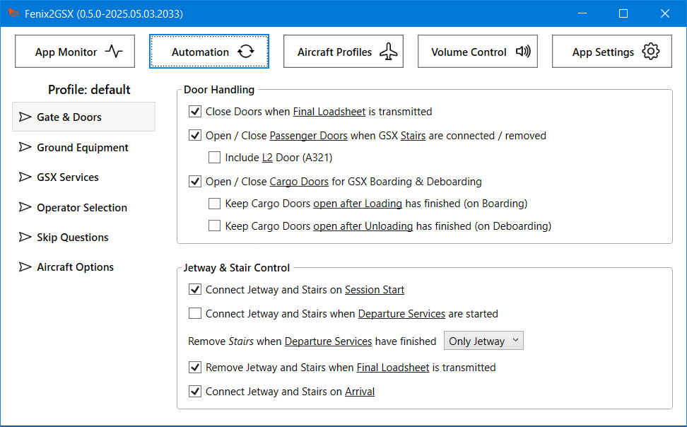

# Fenix2GSX
 
Full and proper GSX Integration and Automation for the Fenix A320 (all Variants, so including the 319/321)!  

- The **Refuel Service is filling the Tanks** as planned (or more correctly GSX and Fenix are "synched")
- Calling **Boarding load's Passengers and Cargo**, as does Deboarding for unloading (or more correctly GSX and Fenix are "synched")
- **Ground Equipment** (GPU, Chocks, PCA) is automatically set or removed
- All **Service Calls** except Pushback, De-Ice and Gate-Selection **can be automated**
- Using the **INT/RAD** Switch as a Shortcut for certain GSX Interactions (i.e. call / confirm Pushback)
- **GSX Audio** and **ATC Volume** can be controlled via the **INT/VHF1-Knob** from the ACP in the Cockpit
- Applications can be **freely mapped** to Audio-Channels
- Can be used, within certain Limits, with the native Integration
- Supports to use the Volume Control without having GSX installed or running (or to solely use the native Integration)

  

## 1 - Introduction

### 1.1 - Requirements

- Windows 10/11, MSFS 2020/2024, Fenix latest :wink:
- A properly working and updated GSX Installation
- Capability to actually read the Readme up until and beyond this Point :stuck_out_tongue_winking_eye:
- The Installer will install the following Software automatically:
  - .NET 8 Desktop Runtime (x64) - Reboot your System if it was installed for the first Time

 

[Download here](https://github.com/Fragtality/Fenix2GSX/releases/latest)

(Under Assests, the Fenix2GSX-Installer-vXYZ.exe File)
 

### 1.2 - Installation, Update & Removal

Just [Download](https://github.com/Fragtality/Fenix2GSX/releases/latest) & Run the **Installer** Binary! It will check and install all Requirements the App (or remove it). Your existing Configuration persists through Updates. 
On the second Installer Page you can select if Auto-Start should be set up for Fenix2GSX (recommended for Ease of Use). 
You do **not need to remove** the old Version for an Update (unless instructed) - using 'Remove' in the Installer completely removes Fenix2GSX and removes it from Auto-Start. This also removes your Configuration including Aircraft Profiles and saved Fuel!  

It is highly likely that you need to **Unblock/Exclude** the Installer & App from BitDefender and other AV-/Security-Software. 
**DO NOT** run the Installer or App "as Admin" - it might work, it might fail.  

When **Upgrading** from Versions **before 0.5.0**:
- Remove the old Version first (with the new Installer)!
- You only need to backup your old Config if you want to go back (the old and new Config Formats are incompatible)
- The MobiFlight Module is not required anymore, the Installer will offer an Option to remove it - if MF Connector and PilotsDeck are not detected.
- Even then it is *your Responsibility* to know if the MobiFlight Module is not required for other Addons on your System and safe to remove!

 

Fenix2GSX will display a **little Exclamation Mark** on its SysTray/Notification Area Icon if a **new Version** (both Stable and Development) is available. There is no Version Pop-Up and there will never be.
  

### 1.3 - Auto-Start

When starting it manually, please do so when MSFS is loading or in the **Main Menu**. Fenix2GSX will directly close if no Simulator is running. 
To automatically start it with **FSUIPC or MSFS**, select the respective Option in the **Installer**. Just re-run it if you want to change if and how Fenix2GSX is auto started. Selecting one Option (i.e. MSFS) will also check and remove Fenix2GSX from all other Options (i.e. FSUIPC), so just set & forget. 
For Auto-Start either your FSUIPC7.ini or EXE.xml (MSFS) is modified. The Installer does not create a Backup (not deemed neccessary), so if you want a Backup, do so yourself.  

#### 1.3.1 - Addon Linker

If you use Addon Linker to start your Addons/Tools, you can also add it there: 
**Program to launch** C:\Users\YOURUSERNAME\AppData\Roaming\Fenix2GSX\bin\Fenix2GSX.exe 
**Wait for simconnect** checked 
The Rest can be left at Default. 

   

## 2 - Configuration

### 2.1 - Fenix EFB

Make sure your **Default State** is set to either Cold & Dark or Turn-Around with GPU or APU - GSX won't provide any Services when the Engines are running. 
All other relevant EFB Options will automatically be disabled by Fenix2GSX. Note that they are not re-enabled! 

  

### 2.2 - GSX Pro

- Make sure you do not have a customized Aircraft Profile (GSX In-Game Menu -> Customize Aircraft -> should show as used Profile "Developer provided" or "Internal GSX Database"). A fair Chunk of Problems come from People having an outdated Custom Profile without knowing it. Just hit the "Reset" Button in the Customize Aircraft Dialog to delete the custom Profile (needs to be done on each Variant!)
- It is recommended (but not required) to enter your **SimBrief Username** and have **Ignore Time** checked to have correct Information on the VDGS Displays.
- For **Automated staircases** semi-automatic (half-checked) is recommended - but it should work with all Modes.
- It is **not recommended** to use the **Always ask for pushback** Option (and if you use it: Fenix2GSX will default to auto-answer with 'Yes')
- The De-/Boarding Speed of Passengers is dependant on the Passenger Density Setting (GSX In-Game Menu -> GSX Settings -> Timings). Higher Density => faster De/Boarding (But "Extreme" can be to extreme in some Cases).
- Ensure the other two Settings under Timings are on their Default (15s, 1x).
- As with GSX itself, Fenix2GSX runs best when you have a proper Airport Profile installed!
- Some Users have reported they also need to disable *Estimate passengers number*.
- Up to everyone's *Preference*, but disabling the **Aural Cues** (GSX In-Game Menu -> GSX Settings -> Audio) and setting **Message verbosity** to "*only Important*" (GSX In-Game Menu -> GSX Settings -> Simulation) can improve Immersion! 😉

  

### 2.3 - Fenix2GSX

The Configuration is done through the **GUI**, open it by **clicking on the System-Tray/Notification-Icon**. You do not need to configure anything to start using Fenix2GSX - although it is *recommended to get yourself familiar* with the Settings. Change them to your Preferences in order to improve your Experience. The default Settings aim to maximize Automation respectively minimize GSX Interaction. All Options have **ToolTips** to explain them further. 
Everything is stored persistently in the *AppConfig.json* File in the Application's Folder - so backup that File in order to backup your Settings! 

  
  
Allmost all Settings regarding GSX, Fenix and the general Automation can be found in the '**Automation**' View. All Settings in this View are stored in a Profile. 
You can have many different Profiles which are automatically loaded depending on the current Aircraft's Registration, Title or Airline. To manage these Profiles use the '**Aircraft Profiles**' View. 
In order map Applications to the different ACP Audio Channels, use the '**Volume Control**' View. The Volume Control Settings are global - thay apply to all Profiles. Volume Control is generally independent from the GSX Integration/Automation. 
All central Settings regarding the Application (so applying to all Profiles) are found in the '**App Settings**' View.  
Most Settings can be **changed dynamically** on the Fly, **BUT**: only change Settings not relevant in the current Automation/Flight Phase. For Example do not change the Departure Services in the Departure Phase and do not change Profiles while Services are active.  
In general, it is up to **your Preference how much Automation** you want. I you want to keep Control of when Services are Called and/or the Jetway is connected, you can still enjoy the (De-)Boarding and Refueling Syncronization when the Automation-Options are disabled. The only Automation which **can not be disabled**: The Removal of the Ground-Equipment is always active to assist with Departure & Push-Back and Arrival.

  

#### 2.3.1 - Automation

These are basically the core Settings to customize the Automation to your own Service-Flow. All Settings in this View are associated to an Aircraft Profile. The currently loaded Profile's Name is displayed on the Category Selection. 
The Settings are grouped into different Categories:  

**Gate & Doors**

Handling if and when the Jetway and or the Stairs are called or removed. 
It also allows you to completely disable the Door Automation. But even then the Doors will automatically be closed when Pushback or Deice become active!

  

**Ground Equipment**

Configure the Chock-Delay, PCA Handling or the Removal when the Beacon is turned on. 
Note: Basic Ground Equipment Handling (GPU, Chocks) is always active and can not be disabled. Fenix2GSX will automatically place or remove the Equipment on Startup, during Pushback and on Arrival.

  

**GSX Services**

Configure how the GSX Services are handled:
- Reposition on Startup (either use Fenix2GSX for that or the GSX Setting - but not both!)
- The Service Activation (if and when) and Order of the Departure Services (Refuel, Catering, Boarding as well as Lavatory & Water)
- How Refueling is handled: with a fixed Rate or a fixed Time Target (or if it is called at all to support Tankering)
- If and when Pushback should be called automatically

**Operator Selection**

Enable or Disable the automatic Operator Selection. You can also define Preferences to control which Operator is picked by Fenix2GSX! If no preferred Operator is found, it will use the 'GSX Choice' in the Menu. 
The Strings you add to the Preferred Operator List will be used in a (case insensitive) Substring-Search - so does Name listed in the Menu contains that Text. The List is evaluated from Top to Bottom - so the higher of two available Operator is choosen.

  

**Skip Questions**

All Options related to skip / automatically Answer certain GSX Questions or Aircraft Interactions: Crew Question, Tug Question, Follow-Me Question, Fenix Cabin-Calls and reopen the Pushback Menu.

  

**Aircraft Options**

Delay for the Final Loadsheet, Save & Load of the Fuel on Board, Randomization of Passengers on OFP Import. 
By default, Fenix2GSX saves the FOB per Aircraft Registration upon Arrival. When you load the same Registration in another Session, it will load/restore the last saved FOB on Startup. If no saved Fuel Value can be found, it uses the Default Value set under App Settings (3000kg).

  

#### 2.3.2 - Aircraft Profiles

The Idea behind Aircraft Profiles is to have *different Automation Settings* for *different Operators* without having the Need to change the Settings manually every time. 
The *Profile Name* is only for display Purposes, it doesn't have a functional Impact. The *Match Type* defines on what Aircraft Information the *Match String* will be compared to. 
When the Session starts and the Connection to the Fenix EFB was successful, Fenix2GSX will automatically switch to the Profile with the best Match:
1) The Aircraft Registration (as reported by the EFB) is matching exactly (case insensitive)
2) The Aircraft Title (as reported by the Sim) contains the Match String (case insensitive)
3) The Aircraft Airline (as reported by the Sim) starts with the Match String (case insensitive)

If there a multiple Results, only the first one will be used. If you want to switch to another Profile, do so before the Departure Phase (OFP was imported). 
The **default Profile** can not be deleted and there can only ever be one Profile using the 'Default' Match Type.

  

#### 2.3.3 - Volume Control

Fenix2GSX will only start to control Volume once the Plane is **powered** (=DC Essential Bus powered). When the Aircraft is powered, Fenix2GSX will set each Audio-Channel to the configured Startup State (e.g. 100% Volume and unmuted for VHF1). **Only one ACP** Panel is used for Volume Control at any given time. But you can change your Seat Position / Panel at any Time (the Startup State is only applied to the Panel selected at that Time). 
When you end your Session (or close Fenix2GSX), Fenix2GSX will try to reset all Audio Sessions of the controlled Applications to their last known State (before it started controlling the Volume). That might not work on Applications which reset their Audio Sessions at the same Time (like GSX). So **GSX can stay muted** when switching to another Plane (if it was muted) - keep that in Mind. 
Fenix2GSX will control **all Audio Sessions** on all Devices for a configured Application by default. You can change the Configuration to limit the Volume Control to a certain Device per Application - but on that Device it will still control all Sessions at once.  

You can map freely Applications to any of the ACP Channels. Per Default ATC Applications are controlled by VHF1, GSX by INT and the Simulator by CAB. You change the Mappings to your Preferences. All Mappings are global - they are not associated to an Aircraft Profile! 
To identify an Application you need to enter it's Binary Name without .exe Extension. The UI will present a List of matching (running!) Applications to your Input to ease Selection. The **Use Mute** Checkbox determines if the **Record Latch** (=Knob is pulled or pushed) is used to mute the Application.  

Some Audio Devices act 'strangely' or throw Exceptions when being scanned by Fenix2GSX for Audio-Sessions. If you have such a Device, you can add it to the Blacklist so that Fenix2GSX ignores it. 
Matching is done on the Start of the Device Name, but it is recommended to use the exact Device Name for blacklisting. Tip: when you hit Ctrl+C on the Device Dropdown (under App Mappings), the selected Device's Name is automatically pasted to Blacklist Input Field.

  

#### 2.3.4 - App Settings

These global Settings affect all Profiles and basic App Features. In most cases you only need to check if the Weight per Bag matches to your SimBrief Profile (the default Value matches the Default in the official SimBrief Profile). 
You might want to change the Weight Unit used in the UI, but you don't need to match that to SimBrief or the Airplane - it's just for displaying Purposes. 
Depending on your Preferences, you might want to check the Settings to round the planned Block Fuel or skipping Walkaround. 
If you only want to use Fenix2GSX for Volume-Control, uncheck 'Run GSX Controller' - in all other Cases leave it on!

   

## 3 - Usage

### 3.1 - General Service Flow / SOP
Note that Fenix2GSX **does not open a Window** when started - it is designed to run in the Background, the Window/GUI is only there for Configuration! There is no Need to have the GUI opened while running the Sim. When you do open the GUI, it can safely be closed (it only closes that Window, it does not Stop the Binary/App itself).
  

#### 3.1.1 - Pre-Flight

- Ensure you use the **correct SimBrief Airframe** Configuration provided by Fenix (with the correct Registration)!
- Ensure that the **Units** used in SimBrief **match** the Units used in the EFB/Aircraft!
- Ensure your default State is either **Cold & Dark** or **Turn-Around with GPU or APU**!

Besides these general Best Practices, there is nothing Special to consider - Plan your Flight as you always do.
  

#### 3.1.2 - Cockpit Preparation

- Make sure Fenix2GSX was already started **before** starting the Session!
- MSFS2024: When **Walkaround** is configured to be **skipped**, Fenix2GSX refocuses MSFS Window repeatedly. This already starts when the Session is about to become ready. So refrain from doing something else in another Window while Walkaround is skipped.
- **Wait** until Fenix2GSX has finished it Startup Steps like Repositioning (if configured), calling Jetway/Stairs (if configured) and restoring the last stored Shutdown FOB. You will be informed with the Cabin **"Ding" Sound** when it has finished these Steps. **Wait** for that Signal **before doing anything** in the EFB or powering up the Plane (when starting Cold & Dark).
- If you have disabled to call Jetway/Stairs on Session Start, you can use the **INT/RAD** Switch (move to the INT Position) to call them at your Discretion (before the Flightplan is imported).
- Mind that selecting a **Panel-State** in the EFB also changes the **ACP State** - that will override Startup State set by Fenix2GSX.
- After that **import the Flightplan** into the EFB to get the Automatic Service-Flow going -OR- **before** you call any GSX Service manually (if you have disabled the Automations).
- It is recommended to **power-up** the Aircraft **before importing** the Flightplan
- If you plan to use **any EFB Loading** Option, remember that you have the Departure Services configured in a certain Way!

  

#### 3.1.3 - Departure Phase

- If you have **choosen to disable** the Automations, call the GSX Services at your Discretion. Note that you do need to **call all Departure Services** which are set to 'Manual' (so that Fenix2GSX switches properly to the Pushback Phase).
- If you **kept on** the Automations, it is advisable to **disable the GSX Menu** (=Icon not white in the Toolbar) to prevent the Menu being displayed when Services are called by Fenix2GSX. (When using the Default Toolbar, see Addon NOTAMs for Flow)
- **Do not** use *Load Aircraft* in the EFB when you intent to use Fenix2GSX for loading the Aircraft!
- **Do not** use *Reset All* regardless if loading through GSX or EFB!
- Use of **Walkaround Mode** while Services are running is **possible with Constraints**:
  - Do not use Walkaround Mode when Doors are about to be opened/closed (else they can't be handled)
- When and in which Order the GSX Services are called depends on your Configuration, per Default it is Refuel + Catering -> Water -> Boarding. You can use the **INT/RAD** Switch to call the next Service in the Queue - i.e. call Boarding earlier.
- The PCA will be removed anytime the **APU is running** and the APU **Bleed is On** (regardless if you have configured Fenix2GSX to place it).
- When **all** Departure Services are **completed** (typically after Boarding), Fenix2GSX will switch to the Pushback Phase. The **Final Loadsheet** will be transmitted 90 - 150 Seconds (Delay configurable) after the Services are completed. 
- With default Settings, the Rear-Stair on Jetway Stand will be removed once the Services are completed.

  

#### 3.1.4 - Pushback Phase

- With default Settings, Jetway/Stairs are removed and Doors are closed once the **Final Loadsheet** is received.
- You can call GSX Pushback once you're ready with the **INT/RAD** Switch. There are also Options to call it automatically when Beacon is on or the Tug was already attached during Boarding.
- You need to **enable the GSX Menu again** for the Pushback Phase to interact with the Menu! Fenix2GSX does not answer the Deice Question or select Pushback Direction.
- With default Settings, Fenix2GSX will **automatically reopen** the Pushback Direction Menu if the GSX Menu should time out (hides itself again).
- With default Settings, the **Ground-Equipment** is removed once you turn on the Beacon (while External Power disconnected and Brake set).
- In any Case, **Ground-Equipment** will be removed **automatically** in this Phase when GSX Pushback/Deice Service is running or when the Engines are running (=start combusting)
- Ground-Equipment is only ever **removed when safe** - i.e. the GPU is only removed when External Power is disconnected or the Chocks when the Brake is set.
- Consider to only call GSX Pushback (either Way) on **Taxi-Out Gates** with are correctly configured in the Airport Profile for that!
- When the Push is running, you can disable the Menu again - you can use the **INT/RAD** Switch to Stop the Push or Confirm the Engine Start (that means Menu Option 1 is always selected when you move the Switch).
- **DO NOT USE ABORT PUSHBACK** (And if only as the very very last Resort, early stopping the Pushback is meant to be commenced with "Stop". If you abort, please set your Parking Brake.)

  

#### 3.1.5 - Taxi-Out Phase

- With default Settings, Fenix2GSX will **automatically answer the Cabin Call** while taxiing
- There is no further Automation or Integration for the Deicing (on Deice Pads), but note that the Operator Selection is also active in this Phase!
- If you loaded your Session **directly on the Runway**, Fenix2GSX will already start in this Phase. So do not spawn on a Runway if you plan to use Departure Services!

  

#### 3.1.6 - Flight Phase

- Enjoy your Flight :wink: Note that Fenix2GSX can be (re)started while you are Airbone. It will continue with the Arrival Services as normal.
- With default Settings, Fenix2GSX will **automatically answer the Cabin Call** on Approach

  

#### 3.1.7 - Taxi-In Phase

- Once the Aircraft is on the Ground again and below 30 Knots, Fenix2GSX will switch to the Taxi-In Phase.
- You can configure Fenix2GSX to (hard) Restart GSX when switching to that Phase
- Please **pre-select** the Gate in the GSX Menu **while** you're **taxiing** to it. If enabled, it will automatically answer the Follow-Me Question with 'No' and select the Operator if needed.
- When using all Automations, you can disable the GSX Menu again after Gate Selection.

  

#### 3.1.8 - Arrival Phase

- The Arrival Phase will only begin once the Aircraft is parked: **Brake is set, Engines are off and Beacon is off**
- **Chocks** will be placed 10-20 Seconds after the Aircraft is parked. When the Chocks were placed, "MECH" Indicator on both ACPs (INT Button) will flash briefly to indicate that. You can release the Parking Brakes then.
- **GPU** and **PCA** (if configured) will be connected once the Jetway or Stairs are connected (or latest when Deboarding starts).
- With default Settings, Fenix2GSX will **automatically call Deboard** (which in turn calls the Jetway/Stairs). If not configured, you can still call Deboarding manually with the **INT/RAD** Switch.
- **Dismiss** the Deboard Pop-Up in the **EFB** - Deboarding is handled by Fenix2GSX at its Synchronization!
- **Wait** for Deboarding to **finish** if you plan for a **Turn-Around** - *do not import* a new Flightplan yet!

  

#### 3.1.9 - Turn-Around Phase

- The Turn-Around Phase will begin once Deboarding has been completed. Fenix2GSX will **reset the EFB** to ensure a clean State. It will play the **Cabin Ding** once it is ready for import.
- As soon as you import a new Flightplan in the EFB, Fenix2GSX will start over with the Departure Phase.
- Fenix2GSX will trigger a SimBrief Reload in GSX so that the VDGS Displays show the new and correct Flight Information.

  

### 3.2 - Service Calls via INT/RAD Switch

You can also use the **INT/RAD** Switch on the ACP (both are monitored) to trigger some Services in certain Situations. Move the Switch to the **INT Position** and **leave it there**. When Fenix2GSX reacts to the Request it will reset the Switch Postion as Confirmation! Services triggerable:

- **Request Jetway/Stairs** - Preparation Phase - If Jetway/Stairs are not called automatically on **Session Start**, you can call them manually with the Switch.
- **Request next Departure Service** - Departure Phase - Call the **next Departure Service**, including Services set to '**Manual**'. In a typical Scenario, you can use the Switch to **start Boarding while Refueling** is still active.
- **Request Pushback** - Pushback Phase - Calls the GSX Pushback Service and **removes Ground-Equipment**. When Pushback was already called but not started yet, you can use the Switch again to **reopen the Direction Menu**.
- **Stop / Confirm Pushback** - Pushback Phase - Selects **Menu Option 1** in the GSX Menu, so depending on the current State (and GSX Settings) it will either **Stop Pushback** or **Confirms** the good **Engine-Start**.
- **Request Deboarding**, after Parking Brake set, Engines off and Beacon off. If Automatic Jetway/Stair Operation is enabled, wait for them to be called. Only works when automatic Deboarding is disabled.

   

## 4 - Addon NOTAMs

### 4.1 - Self-Loading Cargo

Fenix2GSX and **Self-Loading Cargo** (SLC) should work together: Based on User Reports, you need to disable '**Ground Crew**' in SLC! 
Generally you only want one Application to control the Service-Flow and Ground-Equipment.

  

### 4.2 - FlowPro

It is strongly recommended to disable the Option **Skip 'Ready to Fly'**. Else it might happen that Fenix2GSX starts in the Flight State. 
  
In order to enable/disable the GSX Menu-Entry and **prevent** the GSX Menu to open/**pop-up** when Fenix2GSX does the Service Calls, you need to open FlowPro and Scroll on the GSX Icon. Green means on, not-green means off. 

  
NOTE: Please **uninstall** the Plugin **[Flow GSX Launcher](https://de.flightsim.to/file/46482/flow-gsx-launcher)**: it is outdated since that Widget is already included since Flow Version 2023.30.4.13.
  

### 4.3 - FS2Crew

**FS2Crew (Fenix Edition)**: You basically don't need any Ground- or Door-Handling Features of Fs2Crew. This is what another User recommends as Settings to let Fenix2GSX and FS2Crew work together (thanks for sharing): 
  
If you deviate from that, that is fine, but don't bother me with Fenix2GSX is not working properly then - Generally you only want one Application to control the Service-Flow and Ground-Equipment 😜

   

## 5 - NOTAMs (Usage Tips)

### 5.1 - Usage without GSX (Volume Control only)

Just disable *Run GSX Controller* in the **App Settings** View - that disables all of the GSX Integration and Automation! 
Note that this also includes non GSX related Automations like skipping Walkaround or Cabin-Calls.

  

### 5.2 - Usage with native Integration

- You need to configure the Departure Services to 'Manual by User' so that the native Integration can call them
- You need to have the same Services & Order configured under Departure Services as in the EFB (so if you set Fuel+Catering then Boarding in the EFB, do so in Fenix2GSX)
- You can change the 'Wait for Refuel' EFB Setting, but **do not change** any other Setting (besides the Sequence as above)
- **Do not** use the INT/RAD Switch to call the next Departure Service - the native Integration has to call the Services!
- **Do not** call Refuel, Catering or Boarding manually - the native Integration has to call the Services!
- The same applies when you decide to load/board the Aircraft via EFB only (so no GSX at all)! When the Aircraft loaded directly via the EFB, Fenix2GSX will directly switch to the Pushback Phase.

  

### 5.2 - Usage on VATSIM/IVAO

When flying on a Network it might happen that you need to change the Gate after you have started the Session. It is advisable to **disable** the automatic **Call for Jetway/Stairs** in case you need to switch Gates! 
You can manually call the Jetway/Stairs with the **INT/RAD** Switch once you're settled. *Note* that this only works as long as you don't have imported a Flightplan yet!

   

## 6 - FCOM (Troubleshooting)

1) Ensure you have fully read and understand the Readme 😉
2) Ensure you have checked the Instructions below for common/known Issues
3) Ensure your GSX Installation is working correctly - Fenix2GSX ain't gonna fix it!
4) If you report an Issue because you are *really really* sure that Fenix2GSX is misbehaving: provide a **meaningful Description** of the Issue and attach the **Log-File** covering the Issue ('Log-Directory' in the Systray or `%appdata%\Fenix2GSX\log`). If there are **multiple Flights** in one Log (it is one Log per Day for 3 Days), provide a **rough Timestamp** where/when to look.

**NOTE**: It is my personal Decision to provide support or not. So if you don't put any Effort in reading the Readme or properly reporting your Issue, I won't put any Effort in doing any Support or even responding at all. **You need** to help me in order for **me to help you**! 😉  

You can use the '**App Monitor**' View of the UI to monitor the current State of Fenix2GSX:
  

- The **Sim State** Section reports on the Connection to MSFS - it should be all green.
- The **GSX State** Section reports the State of GSX and it Services. Fenix2GSX can only do as good as the Information provided by GSX!
- The **App State** Section reports most noteably reports the current Phase you are in and how many Departure Services are queued - besides the general State of its Services and Connection to the Fenix.
- The **Message Log** Section prints all informational (and above) Messages from the Log - it gives you a rough Idea what Fenix2GSX is doing.

**NOTE**: Although a **Screenshot** of the UI might be helpful in certain Situations, it is **not enough** to report an Issue! Always include the **Log-File**!

  

### 6.1 - Does not Start

- It does not open a Window if you expect that. The GUI is only needed for Configuration and can be opened by clicking on the Icon in the SysTray / Notification Area (these Icons beside your Clock)
- Ensure you have rebooted your PC after .NET 8 was installed
- Check if the .NET Runtimes are correctly installed by running the Command `dotnet --list-runtimes` - it should show an Entry like `Microsoft.WindowsDesktop.App` (with Version 8.0.x).
- Please just don't "run as Admin" because you think that is needed. You can try if that helps, but it should run just fine without that!
- Certain AV/Security Software might require setting an Exception

  

### 6.2 - There are no Log Files

- Please just don't "run as Admin" because you think that is needed. You can try if that helps, but it should run just fine without that!

  

### 6.3 - Fenix2GSX is stuck in a Reposition Loop

Some Issue in your Setup causes a Situation where Fenix2GSX can't read/evaluate the GSX Menu File. But during Reposition (and other Service Calls) Fenix2GSX checks actively to be in the right Menu before selecting anything - so it is stuck in a Loop because it can't get that Information.

- This can happen if GSX is not correctly linked in the Community Folder, use the FSDT Installer to Relink it (and do Check!)
- In past and rare Cases, a complete Reinstall of GSX was needed. Use the Offline Installer (see below) for that.

But generally it would be advisable to eliminate the Root Cause. Maybe a Reinstall through the Offline Installer (see below) or even a complete fresh/clean installation of GSX - in Case your Installation is somehow "corrupted".

  

### 6.4 - Fenix2GSX in Flight/Taxi-In when starting on the Ground

- Can be caused by FlowPro - check the recommended [Settings](#42---FlowPro).

  

### 6.5 - Jetway does not connect

There can be certain Situations where the Jetways stops responding. This an 100% Asobo-Problem: Any Application, including GSX, is then not able to call Jetways anymore via SimEvent ("TOGGLE_JETWAY"). When you are in such a Situation, confirm it by use "Toggle Jetway" in the Fenix EFB. If it still does not move, you experience that MSFS-"Feature". 
This can be caused by too many SimObjects being spawned, check the Tips below to reduce the Object Count. 
The only Workaround is to request the Jetway via ATC Menu. But beware: That does not toggle the mentioned Event, so no Application (i.e. GSX) can detect that the Jetway is connected. 
The Workaround is only for the Visuals, GSX (and therefor Fenix2GSX) should handle the Situation and should be able to deboard the Plane (you won't see any Passengers either Way though).

  

### 6.6 - Refuel Stops / Problems with Boarding or Deboarding / other Erratic Behavior

It is also likely that you have Issues with the SimConnect Interface (the API which both GSX and Fenix2GSX use) being overloaded by too many SimObjects (one of these Things Asobo is incapable or unwilling of fixing). 
In most Cases this is caused by AI Aircraft or other Tools spawning SimObjects (e.g. Nool VDGS or even GSX itself). Reduce the Number of SimObjects and check if it works better then:

- Remove Microsoft Fireworks (see below)
- If only tried while connecting to an Online Network, try if it works in an Offline Session
- Disable Road and Boat Traffic in the MSFS Settings
- Disable Traffic in the MSFS Settings (Airport Vehicle / Ground Aircraft / Worker)
- Reduce the amount of AI Planes in your Tool's Settings
- External AI Tools might have the Option to spawn Ground Services for AI Aircraft (AIG-TC e.g.) - be sure to disable that!
- Disable AI Traffic all together - whether it be MSFS or an external Tool
- Disable "Ground Clutter" in GSX (FSDT Installer -> Config)
- Disable other Addons spawning SimObjects

 

**Remove Microsoft Fireworks**

- Go to the Content Manager
- Search for 'Fireworks'
- The "City Update 3: Texas" should be listed -> go do List View
- Remove the Package "Microsoft Fireworks"

 

**Offline Installer**

There have been also Cases where the GSX Installation was somehow "corrupted". You can try to run the Check in the FSDT Installer multiple Times or use the [offline Installer](https://www.fsdreamteam.com/forum/index.php/topic,26826.0.html) (run a Check again after using that Installer). Else a complete fresh / clean Installation of GSX might be required. 
